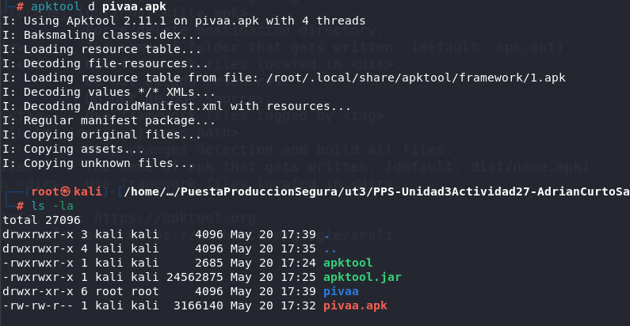
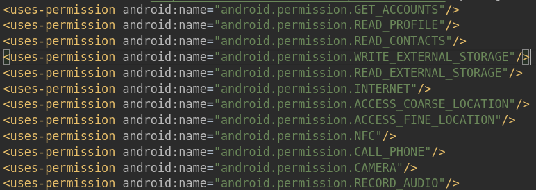
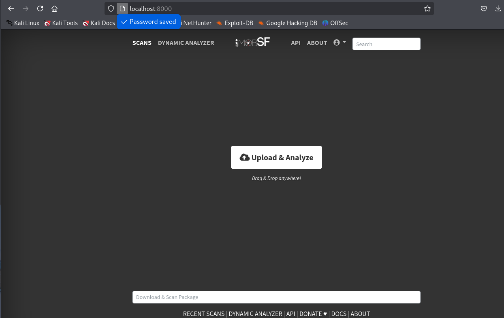
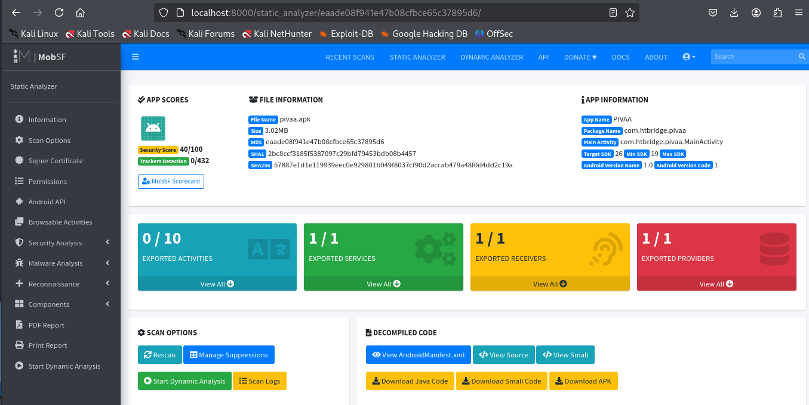
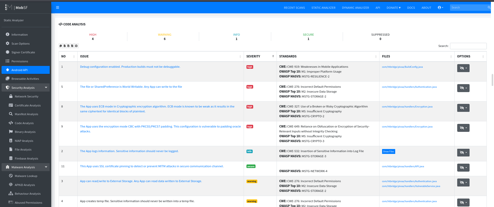

# PPS-AnalisisEstaticoAPKMobSF
Análisis estático de apk con MobSF
# PPS-AnalisisEstaticoAPKMobSF
Análisis estático de apk con MobSF


## Lista de Permisos de 

Descomprimimos el apk con apktool ejecutando `apktool -d pivaa.apk`.



Ahora abrimos el xml del manifest y localizamos los permisos.



Premisos:
- Acceso a cuentas de usuario
- Leer perfiles de usuario
- Acceso a los contactos
- Permisos de esritura y lectura en la unidad de almacenamiento
- Acceso a internet
- Acceso a la localización
- Uso de NFC
- Acceso al teléfono
- Acceso a la cámara
- Acceso al micrófono

## Información sobre las vulnerabilidades

Ejecutamos el contenedor MobSF, para ello ejecutamos el siguiente comando de docker:
```
docker run -it --rm -p 8000:8000 opensecurity/mobile-security-framework-mobsf:latest
```


Y accedemos a la aplicación a través del navegador con la URL http://localhost:8000/login/?next=/ y las credenciales `mobsf:mobsf`.



Arrastramos el apk y obtendremos un informe pinchando en `PDF Report` del menú lateral.



Y en el menú lateral dentro de `Security Analysis > Code Analysis` encontramos las vulnerabilidades.




